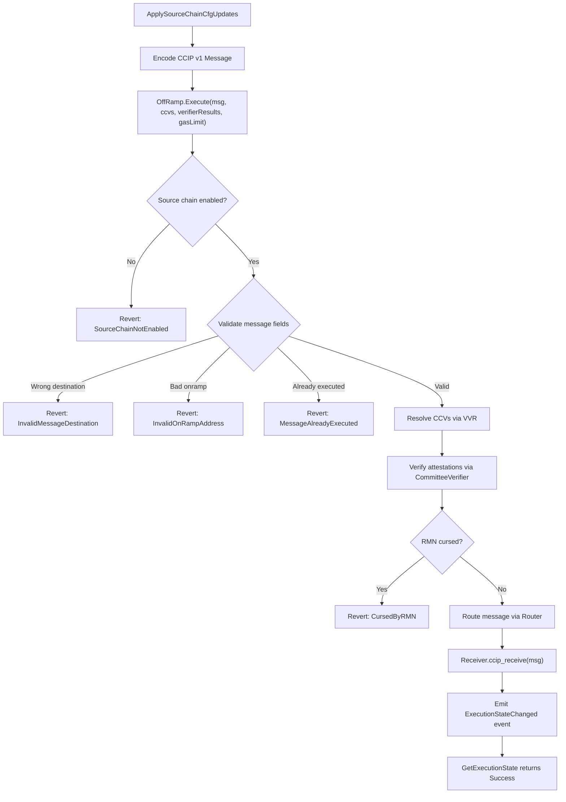

# Integration Test Architecture

This document describes the Stellar CCIP integration test strategy, the contract execution flow,
and how the tests leverage the `chainlink-ccv` devenv infrastructure.

## Execution Flow

The OffRamp `execute` function is the core entry point for inbound cross-chain messages on Stellar.
The following diagram shows the full validation and routing path:



## Contract Stack

A full integration test that exercises `execute` requires the following contracts deployed
and wired together:

| Contract | Role |
|----------|------|
| **RMN Remote** | Tracks curse state for chain subjects |
| **RMN Proxy** | Delegates `is_cursed` checks to RMN Remote |
| **CommitteeVerifier** | Validates signature attestations against configured quorums |
| **VVR (Versioned Verifier Resolver)** | Maps version tags to verifier contract addresses |
| **Router** | Routes verified messages to receiver contracts |
| **OffRamp** | Orchestrates validation, verification, and routing |
| **CCIP Receiver (example)** | Receives and persists messages for test assertions |

### Wiring Order

1. Deploy RMN Remote, initialize with owner + chain selector
2. Deploy RMN Proxy, initialize with owner + RMN Remote address
3. Deploy CommitteeVerifier, initialize with owner + dynamic config + RMN Proxy
4. Configure signature quorum on CommitteeVerifier for the remote source chain
5. Deploy VVR, initialize with owner + fee aggregator
6. Register CommitteeVerifier as inbound implementation on VVR
7. Deploy Router, initialize with owner + RMN Proxy
8. Deploy OffRamp, initialize with owner + static config (chain selector, RMN Proxy, token admin registry)
9. Deploy CCIP Receiver, initialize with Router address
10. Register OffRamp on Router for the remote source chain
11. Apply source chain config on OffRamp (source selector, router, onramps, default CCVs)

## Message Encoding

Messages use the canonical CCIP v1 wire format (`MESSAGE_V1_VERSION = 1`):

```
[1B version] [8B source_chain] [8B dest_chain] [8B seq_no]
[4B exec_gas_limit] [4B ccip_receive_gas_limit] [2B finality]
[32B ccv_executor_hash]
[1B onramp_len] [onramp_bytes]
[1B offramp_len] [offramp_bytes]
[1B sender_len] [sender_bytes]
[1B receiver_len] [receiver_bytes]
[2B dest_blob_len] [dest_blob]
[2B token_transfer_len] [token_transfer]
[2B data_len] [data]
```

The message ID is `keccak256(encoded_message)`.

## Verifier Blob Format

The verifier result blob passed to `Execute` starts with the 4-byte version tag
of the target verifier, followed by the signature payload:

```
[4B version_tag] [2B sig_payload_len] [sig_payload_bytes...]
```

For integration tests with stub signature validation, the signature payload length
is set to 0.

## Test Organization

Integration tests live in `tests/integration/` and use the `integration` build tag.
All tests share a single Stellar quickstart Docker container via `GetSharedTestEnv`.

| Test File | Contracts Tested |
|-----------|-----------------|
| `offramp_test.go` | OffRamp (init, config, execute, error cases, ownership) |
| `router_test.go` | Router + full execute path (OffRamp -> Router -> Receiver) |
| `committee_verifier_test.go` | CommitteeVerifier (config, allowlist, fees, forwarding) |
| `onramp_test.go` | OnRamp (init, dest chain config, dynamic config) |
| `rmn_remote_test.go` | RMN Remote (init, config, curse/uncurse) |
| `versioned_verifier_resolver_test.go` | VVR (init, impl updates, fee aggregator) |

Shared helpers:
- `ccip_v1_wire.go` — CCIP v1 message encoding and `keccak256` message ID
- `contract_deploy_helpers_test.go` — Reusable full-stack contract deployment
- `setup_integration_test.go` — Shared Stellar Docker environment

## Relationship to chainlink-ccv

The `chainlink-ccv` repository defines the `CCIP17Configuration` and `Chain` interfaces
that chain-specific implementations must satisfy. The Stellar implementation in `ccv/chain/`
implements these interfaces, and the integration tests here validate the contract behavior
that underpins them.

Key interface methods and their contract-level equivalents:

| ccv Interface Method | Stellar Contract Operation |
|---------------------|---------------------------|
| `GetConnectionProfile` | Returns lane definition with VVR address refs |
| `DeployContractsForSelector` | Deploys the full contract stack above |
| `PostConnect` | Applies source chain configs on OffRamp |
| `SendMessage` | OnRamp.ccip_send (future) |
| `ManuallyExecuteMessage` | OffRamp.Execute |
| `WaitOneExecEventBySeqNo` | OffRamp.WaitForExecutionStateChangedEvent |
| `Curse` / `Uncurse` | RMN Remote curse/uncurse |
