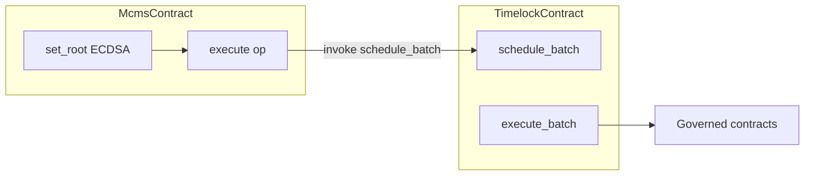

# Soroban governance stack: MCMS & RBACTimelock

**Scope:** This document describes **implemented** Soroban contracts in this repository — [`contracts/mcms/`](../contracts/mcms/) (Many Chain Multi-Sig) and [`contracts/timelock/`](../contracts/timelock/) (RBAC timelock) — including how they fit together and **design choices** that diverge from or align with Solidity references.

**Audience:** Engineers reviewing, deploying, or extending Stellar MCMS/timelock; authors of **off-chain** proposal builders that must reproduce hashes and invoke payloads byte-for-byte.

---

## 1. Architecture overview

| Contract | Role |
|----------|------|
| **MCMS** | Cross-chain–style **multisig over a Merkle root**: threshold ECDSA on `set_root`, ordered **`execute`** of one operation per leaf, each op is a Soroban **`invoke_contract`** (`to` + XDR `data`). Network-bound via passphrase hash at `initialize`. |
| **Timelock** | **RBACTimelock** port: role-gated **schedule → delay → execute** (or **bypass**) for **batches** of calls. Operation identity is **`hash_operation_batch`** (distinct from MCMS Merkle leaves). |

They are **separate crates** with no Rust crate dependency from timelock → mcms. A common deployment pattern is:

- Install **timelock**, grant **PROPOSER** (and optionally other roles) to the **MCMS contract address**.
- MCMS **`execute`** submits an op whose **`to`** is the timelock contract id and whose **`data`** XDR-encodes **`schedule_batch`** (or another timelock entrypoint). Because invocation runs **as MCMS**, timelock role checks see the MCMS contract as `caller`.

See [`test_mcms_execute_timelock_schedule_batch_proposer_self_auth`](../contracts/mcms/src/test.rs) for an end-to-end Soroban test of that wiring.



---

## 2. Shared Stellar conventions

- **`Call.data` / `StellarOp.data`:** XDR for `Vec<Val>` with leading function **`Symbol`**, same decoding path [`decode_invoke_payload`](../contracts/common/helpers/src/soroban_invoke.rs). Malformed XDR may **trap** the host (transaction fails; no partial commit).
- **`keccak256`:** Soroban host crypto (Ethereum-compatible).
- **TTL / storage:** See **§2.1** for Soroban **instance** vs **persistent** storage and how both contracts use `extend_ttl`, archival, and `RestoreFootprintOp`.

### 2.1 Soroban storage classes and TTL (primer)

Soroban separates **where** data lives and **how long** it stays live before it can be **archived** (removed from active ledger state until restored).

| Storage class | Typical use | In these contracts |
|---------------|-------------|-------------------|
| **Instance** | Small, contract-wide singletons living next to the contract’s executable/instance record | MCMS: `CHAIN_NETWORK_ID` ([`lib.rs`](../contracts/mcms/src/lib.rs)). Timelock: `MIN_DELAY` ([`storage.rs`](../contracts/timelock/src/storage.rs)). |
| **Persistent** | Arbitrary key/value contract data; **each key** is its own ledger entry with its own TTL | MCMS: config, maps, root state, `MIN_SPL`, and **every replay-protection key**. Timelock: role map, blocked selectors, **every operation timestamp**. |
| **Temporary** | Ledger-scoped; not used | **Neither** MCMS nor timelock uses `temporary()` storage in the shipped logic. |

**TTL (`extend_ttl`):** Both crates call `extend_ttl(LEDGER_THRESHOLD, LEDGER_BUMP)` with shared numeric intent ([`constants.rs`](../contracts/mcms/src/constants.rs) for MCMS; [`storage.rs`](../contracts/timelock/src/storage.rs) for timelock — same threshold/bump pattern). Roughly: when a bucket’s remaining TTL (in **ledgers**) falls below **`LEDGER_THRESHOLD`** (~1 week at ~5 s/ledger), proactively bump remaining TTL toward **`LEDGER_BUMP`** (~1 year at that cadence). Exact wall-clock time depends on network congestion and seconds-per-ledger; MCMS exposes **`min_secs_per_ledger`** precisely to reason about **seconds** for policy caps.

**Archival vs deletion:** If an entry’s TTL is not extended and expires, the entry becomes **archived**. Archived entries are **not readable** by normal contract logic (`has` / `get` behave like missing). There is **no** Soroban host `restore` inside guest code — only ledger-level **`RestoreFootprintOp`** (with footprint + rent) brings archived entries back.

**Design split:** “Fixed” keys (small known set) are easy to sweep in **`extend_all_ttls`** / internal **`bump_ttls`**. **Unbounded** keys (one per signed root hash, one per timelock operation id) are **not** enumerable from within the contract; they get TTL at **write** time (and timelock refreshes on **read** of that op), or manual **`extend_op_time_ttl`** / archival restore workflows.

---

## 3. MCMS (`contracts/mcms`)

**Solidity reference:** [`ManyChainMultiSig.sol`](https://github.com/smartcontractkit/ccip-owner-contracts/blob/main/src/ManyChainMultiSig.sol) — behavior parity target for roots, signatures, config quorum logic, and Merkle verification style.

### 3.1 Goals (on-chain)

1. **Merkle leaves:** Off-chain builders must supply leaves whose **`keccak256` preimages** match [`hash_stellar_op`](../contracts/mcms/src/abi_encoding.rs) and [`hash_root_metadata`](../contracts/mcms/src/abi_encoding.rs).
2. **`set_root` signing:** Inner hash `keccak256(abi.encode(bytes32 root, uint32 validUntil))` then **EIP-191** personal-sign over that 32-byte digest ([`hash_set_root_inner`](../contracts/mcms/src/abi_encoding.rs), [`eth_signed_message_hash_32`](../contracts/mcms/src/abi_encoding.rs)).
3. **Signers:** Ethereum **address identity**, stored as **32-byte left-padded** words; recovery via secp256k1 with **low-s** ([`recover_eth_address_vrs`](../contracts/mcms/src/crypto.rs)).
4. **Chain binding:** [`initialize`](../contracts/mcms/src/lib.rs) stores **network passphrase hash** (`ChainID` from chain-selectors: 32-byte hex) in **instance** storage (`CHAIN_NETWORK_ID`); metadata and ops must match.

### 3.2 MCMS storage map (instance vs persistent)

| Key / pattern | Storage class | Contents |
|---------------|---------------|----------|
| `CHAIN_NETWORK_ID` | **Instance** | `BytesN<32>` network passphrase hash set once at `initialize`. |
| `INITIALIZED`, owner keys | **Instance** | From `Initializable` / `Ownable` helpers (same instance bucket as other framework keys). |
| `CONFIG`, `SIGNER_MAP`, `EXPIRING_ROOT`, `ROOT_META_STORE` | **Persistent** | Merkle root metadata, op counter, signer config (fixed Soroban `Symbol` keys — see [`lib.rs`](../contracts/mcms/src/lib.rs)). |
| `MIN_SPL` | **Persistent** | Operator `min_secs_per_ledger` for dynamic `validUntil` cap (optional; default used if unset). |
| **`signedHash` (`BytesN<32>`)** | **Persistent** | Replay marker: value `bool` `true`. **One ledger entry per distinct EIP-191 digest** ever accepted by `set_root`. |

[`bump_ttls`](../contracts/mcms/src/lib.rs) extends **instance** TTL and **only** the fixed persistent keys above — **not** unbounded per-`signedHash` entries.

### 3.3 Leaf hashing model

| Layer | Implementation |
|-------|----------------|
| **Outer leaf** | Solidity **ABI v1–style** packing + `keccak256`: domain constants `DOMAIN_OP_STELLAR` / `DOMAIN_META_STELLAR` ([`constants.rs`](../contracts/mcms/src/constants.rs)) then typed tuples ([`abi_encoding.rs`](../contracts/mcms/src/abi_encoding.rs)). |
| **Opaque `data`** | Dynamic **`bytes`** inside the ABI op tuple; contents are **not** EVM calldata — they are **Soroban invoke** XDR (§2). |

### 3.4 Domain separators

UTF-8 strings; on-chain **fixed 32-byte words** (keccak of each string):

- `MANY_CHAIN_MULTI_SIG_DOMAIN_SEPARATOR_OP_STELLAR`
- `MANY_CHAIN_MULTI_SIG_DOMAIN_SEPARATOR_METADATA_STELLAR`

### 3.5 Merkle tree

Pair hash [`efficient_hash_pair`](../contracts/mcms/src/crypto.rs): `keccak256(concat(sort(a,b)))` lexicographic on `bytes32`. **Leaf ordering** for the tree builder off-chain must match the policy used for EVM MCMS proposals (typically **sort leaf hashes by hex string**).

### 3.6 Structs & ABI roles ([`types.rs`](../contracts/mcms/src/types.rs))

`StellarRootMetadata` / `StellarOp` use Soroban `#[contracttype]` fields; hashing enforces **`uint40`** range for counts/nonce via [`McmsError::InvalidUint40`](../contracts/mcms/src/error.rs). `StellarOp.value` must be **zero** (v1). Solidity-shaped reference:

```solidity
struct StellarRootMetadata {
    uint256 chainId;
    bytes32 multiSig;
    uint40 preOpCount;
    uint40 postOpCount;
    bool overridePreviousRoot;
}

struct StellarOp {
    uint256 chainId;
    bytes32 multiSig;
    uint40 nonce;
    bytes32 to;
    uint256 value;   // MUST be 0 in v1
    bytes data;
}
```

### 3.7 Replay protection & `validUntil`

#### Replay protection (`signedHash` entries)

When **`set_root`** accepts a new root, it computes:

1. `inner = hash_set_root_inner(root, validUntil)`
2. `signedHash = eth_signed_message_hash_32(inner)` (EIP-191 over the 32-byte `inner`)

It then **`persistent().has(&signedHash)`** before verifying signatures; after success it **`persistent().set(&signedHash, &true)`** and **`persistent().extend_ttl(&signedHash, LEDGER_THRESHOLD, LEDGER_BUMP)`** once ([`lib.rs`](../contracts/mcms/src/lib.rs)).

**Why persistent, not instance:** Each distinct governance signing session produces a distinct `signedHash`; the set grows with history. Instance storage is not suited for unbounded distinct keys.

**Why not swept by `bump_ttls`:** The contract cannot iterate all historical `signedHash` keys (no enumeration API). Permissionless **[`extend_all_ttls`](../contracts/mcms/src/lib.rs)** therefore **only** refreshes **instance** + **fixed** persistent keys (`CONFIG`, `SIGNER_MAP`, `EXPIRING_ROOT`, `ROOT_META_STORE`, `MIN_SPL`). Each replay entry must rely on its **initial** TTL bump at `set_root`, optional **manual** TTL extension via transactions that touch that key (not exposed as a dedicated MCMS entrypoint), or **`RestoreFootprintOp`** if archived.

**Safety vs archival:** If a `signedHash` entry archives, **`has(&signedHash)` returns false**, so an old signed `(root, validUntil)` might appear “replayable” from storage’s perspective. The design **does not rely** on archived replay entries: **`validUntil`** is capped so that any root that could still be submitted must have **`validUntil` still in the future** relative to ledger time *before* the replay check matters, and the **dynamic cap** ties worst-case persistent lifetime of a **newly** written replay entry to that horizon (see below). Roots with expired `validUntil` are rejected regardless of replay storage state.

#### `validUntil` policy (timestamp vs TTL linkage)

- **Type / comparison:** `uint32` **Unix seconds**; compared to **`Env::ledger().timestamp()`** (not ledger sequence).
- **Past:** `validUntil < now` ⇒ reject (`ValidUntilHasAlreadyPassed`).
- **Upper bound** at `set_root`:

  ```
  effective_max_secs = min(
      MAX_ROOT_VALIDITY_SECS,                                                    // 90 days; static
      LEDGER_BUMP * min_secs_per_ledger - SEEN_TTL_SAFETY_MARGIN_SECS             // dynamic “ledger TTL → seconds” minus 1 week margin
  )
  ```

  Constants and defaults: [`constants.rs`](../contracts/mcms/src/constants.rs); **`min_secs_per_ledger`** is persisted (`MIN_SPL`) and set by owner via **`set_min_secs_per_ledger`** (clamped to `[MIN_SECS_PER_LEDGER_LOWER_BOUND, MIN_SECS_PER_LEDGER_UPPER_BOUND]`).

**Intent:** The **dynamic** term approximates “how long a brand-new persistent replay entry could stay live” in **seconds** by treating **`LEDGER_BUMP`** ledgers × **`min_secs_per_ledger`** as a pessimistic wall-clock envelope, then subtracting **`SEEN_TTL_SAFETY_MARGIN_SECS`** (1 week) so the chosen `validUntil` horizon **expires before** the replay entry is likely to archive — avoiding a window where the root is still valid but replay protection is gone. The **static** `MAX_ROOT_VALIDITY_SECS` caps this regardless of TTL math. A **compile-time assertion** in `constants.rs` relates the static cap + margin to the default min seconds-per-ledger so defaults cannot silently drift.

### 3.8 Config

`NUM_GROUPS` = 32, `MAX_NUM_SIGNERS` = 200; `Signer` uses **`u32`** index/group; group tree validation matches MCMS/Solidity constraints ([`validate_group_tree`](../contracts/mcms/src/lib.rs)).

### 3.9 `execute`

Verifies op leaf under current root, checks nonce vs stored op count, decodes `data`, **`try_invoke_contract`** to `to`. Successful invoke **then** increments op count (failed invoke does not consume nonce).

### 3.10 Authorization

MCMS acts as **itself** when invoking downstream contracts; callees must **`require_auth`** for the MCMS contract address where governance expects it.

### 3.11 ABI fragments (informative)

Metadata tail: `(uint256,bytes32,uint40,uint40,bool)`  
Op tail: `(uint256,bytes32,uint40,bytes32,uint256,bytes)`  
Signing inner: `(bytes32,uint32)`

---

## 4. RBACTimelock (`contracts/timelock`)

**Solidity reference:** [`RBACTimelock.sol`](https://github.com/smartcontractkit/ccip-owner-contracts/blob/main/src/RBACTimelock.sol) — role names and batch/delay semantics; see below for **intentional** Soroban differences.

### 4.1 Roles

[`types.rs`](../contracts/timelock/src/types.rs): `ADMIN`, `PROPOSER`, `EXECUTOR`, `CANCELLER`, `BYPASSER`. Admin grants/revokes roles; **`initialize`** wires initial role holders and **`min_delay`**.

**Design note:** Comments recommend **`admin`** be a **contract** (e.g. multisig), not an EOA.

### 4.2 Calls & invoke payload

[`Call`](../contracts/timelock/src/types.rs): `to: BytesN<32>`, `data: Bytes` — **no native XLM value** field (v1). `data` uses the **same XDR convention as MCMS `StellarOp.data`** (§2). [`Calls`](../contracts/timelock/src/types.rs) wraps `Vec<Call>` for the Soroban ABI.

### 4.3 Operation ID hashing

Pure function [`hash_operation_batch`](../contracts/timelock/src/lib.rs) / [`hash_operation_batch_internal`](../contracts/timelock/src/lib.rs):

```text
call_hash_i = keccak256(to_i || keccak256(data_i))
id = keccak256(n_calls_as_uint256_be || call_hash_0 || … || call_hash_n || predecessor || salt)
```

`n_calls` is encoded as a **32-byte big-endian uint256**; `predecessor` and `salt` are `bytes32`. This is **independent** of MCMS Merkle leaf hashing.

### 4.4 Lifecycle & security choices

- **`schedule_batch`:** Checks **`min_delay`**, blocked selectors (**schedule time only**), predecessor readiness; writes **ready timestamp** (`now + delay`) to per-id storage.
- **`execute_batch`:** Requires executor or admin; requires delay elapsed; **`DONE_TIMESTAMP` (1)** semantics mirror Solidity (`is_operation_done`).
- **Re-entrancy / ordering:** Operation is marked **DONE before** executing inner calls (**stricter than Solidity**, which marks after). On **`CallReverted`**, the whole tx reverts including DONE — matches “no partial success” expectation for atomic batches.
- **`bypasser_execute_batch`:** No delay; **blocked-selector checks are skipped** (Solidity parity).
- **Blocked selectors:** Stored as Soroban **`Symbol`** list ([`BLK_SEL`](../contracts/timelock/src/storage.rs)); compared against the decoded invoke symbol from each scheduled call’s `data`.

### 4.5 Storage & TTL

#### Storage map (instance vs persistent)

| Key / pattern | Storage class | Contents |
|---------------|---------------|----------|
| `MIN_DELAY` (`MNDELAY`) | **Instance** | Minimum delay (seconds) between schedule and execute; set at `initialize`, updatable by admin ([`storage.rs`](../contracts/timelock/src/storage.rs)). |
| `INITIALIZED` | **Instance** | From `Initializable` helper. |
| `ROLES_KEY` (`ROLES`) | **Persistent** | `Map<Symbol, Vec<Address>>` — role membership lists. |
| `BLK_SEL` | **Persistent** | `Vec<Symbol>` — blocked function names (schedule-time checks). |
| **`TimelockDataKey::OpTime(id)`** | **Persistent** | `u64` timestamp **per operation id** (`bytes32`): `0` = unset, `1` = **`DONE_TIMESTAMP`** (executed), `>1` = unix seconds when batch becomes executable until consumed ([`types.rs`](../contracts/timelock/src/types.rs), [`storage.rs`](../contracts/timelock/src/storage.rs)). |

**Temporary storage:** Not used by the timelock contract logic.

#### TTL behavior

**Instance + fixed persistent bucket:** [`bump_ttls`](../contracts/timelock/src/storage.rs) calls **`instance().extend_ttl(LEDGER_THRESHOLD, LEDGER_BUMP)`** and, if present, extends **`ROLES_KEY`** and **`BLK_SEL`** persistent entries the same way. **[`extend_all_ttls`](../contracts/timelock/src/lib.rs)** is permissionless and simply invokes `bump_ttls`.

**Per-operation entries (`OpTime`):**

- **`set_op_timestamp` / `get_op_timestamp`:** On access, if the entry exists, the contract **`extend_ttl`** that specific persistent key (`LEDGER_THRESHOLD`, `LEDGER_BUMP`) so normal scheduling / execution / queries keep hot ids alive.
- **Not swept globally:** There is **no** loop over all operation ids — same pattern as MCMS replay keys.
- **Deletion:** **`delete_op_timestamp`** removes the persistent entry (e.g. cancel path) — distinct from archival.

**DONE predecessors & long gaps:** After **`execute_batch`**, the id’s timestamp becomes **`DONE_TIMESTAMP` (1)**. If a **later** operation uses that id as **`predecessor`**, **`execute_batch`** requires the predecessor entry to still be readable with value **exactly** `DONE_TIMESTAMP`. If that predecessor entry **archived** because nobody touched it for longer than its TTL, **`get_op_timestamp`** returns **`0`** ⇒ **`MissingPredecessor`**. Operators should **`extend_op_time_ttl(predecessor_id)`** (permissionless) for DONE ids that must stay probeable, or use **`RestoreFootprintOp`** if already archived — documented in [`lib.rs`](../contracts/timelock/src/lib.rs) module docs.

**Relation to MCMS:** MCMS documents the same archival / restore mental model for its per-hash replay entries (§3.7); timelock’s **`OpTime`** entries behave analogously but keyed by **`hash_operation_batch`**.

### 4.6 Queries & maintenance

`is_operation`, `is_operation_pending`, `is_operation_ready`, `is_operation_done`, `get_timestamp`, role getters, `extend_all_ttls`, `extend_op_time_ttl` — see [`lib.rs`](../contracts/timelock/src/lib.rs).

---

## 5. Composing MCMS with timelock (deployment pattern)

Not enforced in code: operators choose whether MCMS **only** drives timelock, or also calls other contracts directly.

**Typical gated flow:**

1. Timelock **`initialize`**: include MCMS contract address in **`proposers`** (and assign executors/cancellers/bypassers per policy).
2. Root on MCMS includes a **`StellarOp`** whose **`to`** is timelock’s contract id and **`data`** encodes **`schedule_batch`** with the batch the multisig intends to queue.
3. After delay, **`execute_batch`** on timelock runs (invoked by an executor EOA or automation); inner calls hit governed contracts.

MCMS **does not** embed timelock addresses in storage; binding is entirely via **Merkle leaves** and **role configuration** on timelock.

---

## 6. References

| Topic | Reference |
|-------|-----------|
| MCMS behavior | [`ManyChainMultiSig.sol`](https://github.com/smartcontractkit/ccip-owner-contracts/blob/main/src/ManyChainMultiSig.sol) |
| Timelock behavior | [`RBACTimelock.sol`](https://github.com/smartcontractkit/ccip-owner-contracts/blob/main/src/RBACTimelock.sol) |
| Network id | [`chain-selectors`](https://github.com/smartcontractkit/chain-selectors) Stellar `ChainID` |
| MCMS crate | [`contracts/mcms/`](../contracts/mcms/) |
| Timelock crate | [`contracts/timelock/`](../contracts/timelock/) |
